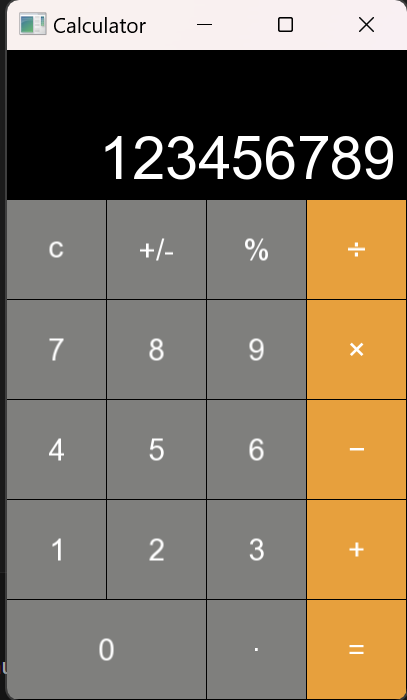

# Project Title: Calculator APP

Last edited: November 2023.

* Supports cursor and keyboard input
* Max number length 10
* Numbers shrink after 6 entered.

## Features

* SFML

## Screenshots

## Compilation

The project uses a Makefile for compilation. To compile the project, use the following command:

**make**

To build from scratch run

**make clean**

**make**

This command will compile the necessary files and link the necessary libraries according to the rules defined in the Makefile.

## License

This project is licensed under the MIT License.
